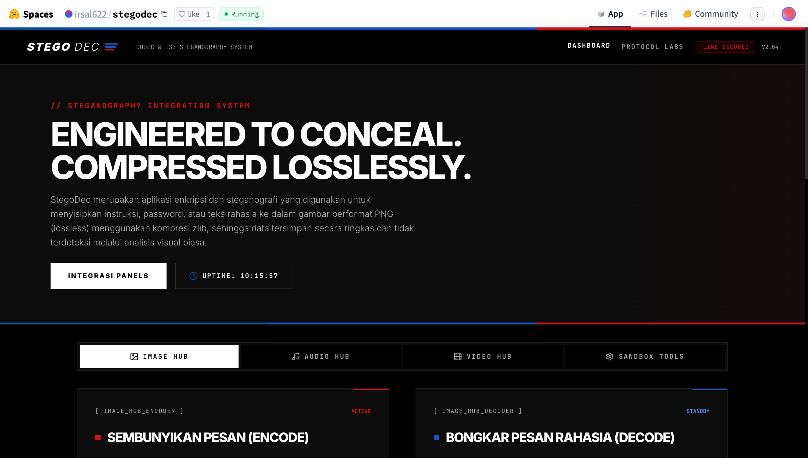

<h1>🛡️ StegoDec</h1>

<p><strong>Multimedia Steganography &amp; Codec System — LSB Image, Audio &amp; Video</strong></p>

<p>
  <a href="#features">Features</a> •
  <a href="#tech-stack">Tech Stack</a> •
  <a href="#architecture">Architecture</a> •
  <a href="#quick-start">Quick Start</a> •
  <a href="#api-reference">API Reference</a> •
  <a href="#deployment">Deployment</a>
</p>

<p>
  
  
  
  
</p>
<p>
  <a href="https://github.com/Irs622/StegoDec-Sistem-Codec-Steganografi-LSB-"></a>
  <a href="https://github.com/Irs622/StegoDec-Sistem-Codec-Steganografi-LSB-/releases"></a>
  <a href="https://github.com/Irs622/StegoDec-Sistem-Codec-Steganografi-LSB-/stargazers"></a>
  <a href="https://huggingface.co/spaces/irsal622/stegodec"></a>
</p>

<p>
  <a href="https://huggingface.co/spaces/irsal622/stegodec">👉 <strong>Try the live demo on Hugging Face Spaces</strong></a>
</p>

</div>

---

## 🖥️ Preview



---

## 📖 Overview

**StegoDec** is a full-stack web application that integrates three core information-security disciplines into a single unified interface:

| Layer | Technology | Purpose |
|---|---|---|
| 🔐 **Encryption** | Vigenere-XOR Cipher + Random Salt | Secures the secret message before embedding |
| 📦 **Compression** | Zlib / Deflate (Level 9) | Minimises payload size to reduce carrier distortion |
| 🖼️ **Steganography** | LSB Scrambling (PRNG-seeded) | Hides the encrypted payload inside media files |

The system is architected as a **Single Page Application (SPA)** with a Python/Flask backend exposing a clean REST API, and a vanilla JS frontend for a smooth, zero-reload experience.

---

## ✨ Features <a id="features"></a>

### 🖼️ Image Hub
- **Steganography** — PRNG-scrambled LSB pixel embedding with Vigenere-XOR encryption and Zlib pre-compression. Output locked to lossless **PNG** format to guarantee zero-bit-loss.
- **Codec** — Lossy/lossless image compression to **JPEG**, **WebP**, and **PNG** with adjustable quality (1–100) or compression level (0–9).

### 🎵 Audio Hub
- **Steganography** — LSB embedding into raw PCM samples of **WAV** files (8-bit or 16-bit). Payload modification is imperceptible (&lt;-70 dB SNR impact).
- **Codec** — Audio file reduction via **downsampling** (e.g. 44.1 kHz → 16 kHz) and **bit-depth reduction** (16-bit → 8-bit PCM).

### 🎥 Video Hub
- **Steganography** — Spatial-temporal LSB embedding per-frame into **AVI** files encoded with the **FFV1 (lossless)** codec, preventing re-compression bit corruption.
- **Codec** — Video compression via **resolution scaling** (spatial) and **FPS reduction** (temporal).

### 🛠️ Sandbox Tools
- Standalone **Vigenere-XOR** cryptography playground — encrypt/decrypt any text directly in the browser.
- Standalone **Zlib Deflate** compression inspector — compress/decompress raw data and view compression ratios in real time.

---

## 🛠️ Tech Stack <a id="tech-stack"></a>

| Category | Technology |
|---|---|
| **Backend** | Python 3.9+, Flask 3.x |
| **Image Processing** | OpenCV (`opencv-python-headless`), NumPy |
| **Audio Processing** | Python `wave` (stdlib) |
| **Compression** | Python `zlib` (stdlib) |
| **Cryptography** | Custom Vigenere-XOR cipher with PRNG salt |
| **Frontend** | Vanilla HTML5, CSS3, JavaScript (SPA) |
| **Containerisation** | Docker (python:3.9-slim) |
| **Deployment** | Hugging Face Spaces (Docker SDK), Vercel |

---

## 🏗️ Architecture <a id="architecture"></a>

### System Data Flow

```
User Input (plaintext message)
        │
        ▼
┌─────────────────┐
│  Vigenere-XOR   │  ← Password + Random Salt
│   Encryption    │
└────────┬────────┘
         │ Ciphertext
         ▼
┌─────────────────┐
│  Zlib Deflate   │  ← Level 9 Compression
│   Compression   │
└────────┬────────┘
         │ Compressed Bytes
         ▼
┌─────────────────┐
│ LSB Scrambling  │  ← PRNG seed derived from password
│   Embedding     │
└────────┬────────┘
         │
         ▼
   Stego Media File
   (PNG / WAV / AVI)
```

### Project Structure

```
StegoDec/
├── app.py                  # Flask backend — routing, REST API & all algorithm logic
├── requirements.txt        # Python dependencies
├── Dockerfile              # Docker container config (Hugging Face Spaces)
├── vercel.json             # Vercel serverless deployment config
├── templates/
│   └── index.html          # SPA frontend — dashboard with four hub panels
└── static/
    ├── css/
    │   └── style.css       # Dark-mode UI theme, neon grid & transition animations
    └── js/
        └── app.js          # Frontend controller — AJAX fetch API & event listeners
```

---

## 🚀 Quick Start <a id="quick-start"></a>

### Prerequisites

- **Python 3.9+** installed on your system
- **pip** package manager

### 1. Clone the Repository

```bash
git clone https://github.com/Irs622/StegoDec-Sistem-Codec-Steganografi-LSB-.git
cd StegoDec-Sistem-Codec-Steganografi-LSB-
```

### 2. Create & Activate Virtual Environment

```bash
# macOS / Linux
python3 -m venv venv
source venv/bin/activate

# Windows
python -m venv venv
venv\Scripts\activate
```

### 3. Install Dependencies

```bash
pip install -r requirements.txt
```

### 4. Run the Development Server

```bash
python3 app.py
```

Open your browser and navigate to:

```
http://localhost:5001
```

---

## 🐳 Deployment <a id="deployment"></a>

### Docker (Local / Self-hosted)

```bash
# Build the image
docker build -t stegedec .

# Run the container
docker run -p 7860:7860 stegedec
```

Access the app at `http://localhost:7860`.

### Hugging Face Spaces

🌐 **Live instance**: [huggingface.co/spaces/irsal622/stegodec](https://huggingface.co/spaces/irsal622/stegodec)

This repo is pre-configured for **Hugging Face Spaces** via the Docker SDK. The `Dockerfile` exposes port `7860` and the YAML frontmatter at the top of this README is read by Spaces for metadata configuration.

To deploy your own copy: push this repository to a Hugging Face Space with the **Docker** SDK selected.

### Vercel (Experimental)

A `vercel.json` is included for serverless deployment. Note that stateful uploads are ephemeral in serverless environments.

```bash
vercel --prod
```

---

## 🔌 API Reference <a id="api-reference"></a>

All endpoints accept `multipart/form-data` and return JSON, unless a file download is triggered.

### Image

| Method | Endpoint | Description |
|---|---|---|
| `POST` | `/encode/image` | Embed encrypted message into a PNG |
| `POST` | `/decode/image` | Extract and decrypt message from a stego PNG |
| `POST` | `/compress/image` | Compress image to JPEG / WebP / PNG |

### Audio

| Method | Endpoint | Description |
|---|---|---|
| `POST` | `/encode/audio` | Embed encrypted message into a WAV |
| `POST` | `/decode/audio` | Extract and decrypt message from a stego WAV |
| `POST` | `/compress/audio` | Compress WAV via downsampling & bit-depth reduction |

### Video

| Method | Endpoint | Description |
|---|---|---|
| `POST` | `/encode/video` | Embed encrypted message into an AVI (FFV1) |
| `POST` | `/decode/video` | Extract and decrypt message from a stego AVI |
| `POST` | `/compress/video` | Compress video via resolution & FPS scaling |

### Sandbox

| Method | Endpoint | Description |
|---|---|---|
| `POST` | `/sandbox/encrypt` | Encrypt / decrypt text with Vigenere-XOR |
| `POST` | `/sandbox/compress` | Compress / decompress data with Zlib |

---

## 🔬 Algorithm Deep Dive

### LSB Scrambling with PRNG

Standard sequential LSB is vulnerable to statistical steganalysis. StegoDec counters this with **PRNG-based index scrambling**:

1. A seed is derived from the user's password via SHA-256.
2. The PRNG shuffles the list of all available pixel/sample indices.
3. Bits are embedded at **randomised, non-sequential positions** in the carrier.

Without the correct password, an attacker cannot determine which pixels were modified or in what order.

### Vigenere-XOR Cipher

```
plaintext
  → UTF-8 bytes
  → XOR with key stream (key = password + random_salt, extended with positional modifiers)
  → base64 encoded
  → stored as: SECURE_{salt}_{ciphertext}
```

A **random 3-digit salt** is appended each time, ensuring the same plaintext encrypted with the same password always produces a unique ciphertext (prevents known-plaintext attacks).

### Why Lossless Carriers Only?

| Format | Compression | LSB Safe? |
|---|---|---|
| PNG | DEFLATE (lossless) | ✅ Yes |
| WAV (PCM) | None | ✅ Yes |
| AVI (FFV1) | Lossless intra-frame | ✅ Yes |
| JPEG | DCT (lossy) | ❌ No — destroys LSBs |
| MP4 (H.264) | Inter-frame (lossy) | ❌ No — destroys LSBs |

---

## 📊 Performance Benchmarks

| Test Case | Result |
|---|---|
| Image Stego round-trip (PNG) | ✅ 100% extraction accuracy |
| Audio Stego round-trip (WAV) | ✅ 100% extraction accuracy · &lt;-70 dB perceptual impact |
| Video Stego round-trip (AVI/FFV1) | ✅ 100% extraction accuracy |
| Audio Compression (64 KB WAV) | 64 KB → 16 KB — **74.9% reduction** |
| Video Compression (1.0 MB AVI) | 1.0 MB → 14 KB — **98.6% reduction** |

---

## ❓ FAQ

<details>
<summary><strong>Why must stego video files use AVI (FFV1) instead of MP4?</strong></summary>

Standard containers like MP4 use inter-frame lossy codecs (H.264/H.265) that predict and discard pixel data between frames to reduce file size. This destroys the LSB bits we embed. **FFV1** is mathematically lossless — every bit in every frame is stored exactly as written.

</details>

<details>
<summary><strong>Is the steganographic modification audible in WAV files?</strong></summary>

No. LSB audio steganography alters only the least-significant bit of each PCM amplitude sample. For a Zlib-compressed text payload, the number of modified samples is very small, producing noise well below the threshold of human hearing (~-70 dB). The change is completely imperceptible.

</details>

<details>
<summary><strong>Will stego files survive WhatsApp / Telegram transfer?</strong></summary>

Not via the standard media-share flow — those platforms re-compress images and videos automatically, destroying LSB data. **Send stego files as a document** ("Send as Document" / "Send as File") to transfer the raw binary intact. Email attachments and cloud storage (Google Drive, Dropbox) also preserve file integrity.

</details>

<details>
<summary><strong>What is the maximum embeddable message size?</strong></summary>

Capacity depends on carrier file size. For images: up to `(width × height × 3) / 8` bytes minus header overhead. Zlib pre-compression significantly reduces payload size, increasing effective capacity for text data.

</details>

---

## 📄 License

Released under the **MIT License**. See [`LICENSE`](./LICENSE) for details.

---

<div align="center">

Built with ❤️ using Python, Flask &amp; OpenCV

</div>
